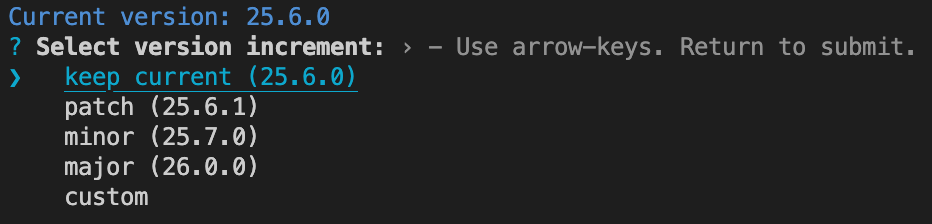

# expo-version

Version management tool for Expo React Native apps, similar to `npm version` but designed specifically for Expo projects.



## Use Case

**Problem**: When using EAS Build, you need to manually update the version in `app.json` before triggering a build. This manual process is error-prone and breaks your development flow.

**Solution**: `expo-version` integrates seamlessly into your build workflow by prompting for version updates before builds, ensuring your app version is always up-to-date.

### Typical Workflow Integration

```json
{
  "scripts": {
    "build:ios": "expo-version && eas build --platform ios",
    "build:android": "expo-version && eas build --platform android",
    "build:all": "expo-version && eas build --platform all"
  }
}
```

Now when you run `npm run build:ios`, it will:

1. 🔍 Show your current version from `app.json`
2. 🎯 Prompt you to select the new version (keep current/patch/minor/major/custom)
3. 📝 Update both `app.json` and `package.json` (if version changed)
4. 📦 Commit and tag the version change (if version changed)
5. 🚀 Trigger the EAS build with the correct version

**Result**: No more forgetting to update versions, no more builds with wrong version numbers, and a clean git history of your releases.

## Features

- 📱 **Expo-specific**: Reads and updates versions in both `app.json` and `package.json`
- 🎯 **Interactive**: Prompts for version increments (patch, minor, major) or custom versions
- 🔧 **Git integration**: Automatically creates commits and tags
- 🚀 **EAS compatible**: Works seamlessly with EAS Build lifecycle hooks
- 🛡️ **TypeScript**: Fully typed with TypeScript support
- 📦 **Semver compliant**: Uses semantic versioning standards

## Installation

```bash
npm install -g expo-version
```

Or use it directly with npx:

```bash
npx expo-version
```

## Usage

### Interactive mode

Simply run the command and select your preferred version increment:

```bash
expo-version
```

This will:

1. Show the current version from `app.json`
2. Prompt you to select from these options:
   - **keep current** - Keep the existing version (useful for rebuilds)
   - **patch** - Increment patch version (e.g., 1.2.3 → 1.2.4)
   - **minor** - Increment minor version (e.g., 1.2.3 → 1.3.0)
   - **major** - Increment major version (e.g., 1.2.3 → 2.0.0)
   - **custom** - Enter a custom version
3. Update both `app.json` and `package.json` (if version changed)
4. Create a git commit and tag (if in a git repository and version changed)

### Direct version specification

Specify the exact version you want:

```bash
expo-version 1.2.3
```

### Skip git tagging

Use the `--no-git-tag-version` flag to prevent git tag creation:

```bash
expo-version 1.2.3 --no-git-tag-version
```

## Options

| Option                 | Description                                       |
| ---------------------- | ------------------------------------------------- |
| `--no-git-tag-version` | Prevent git tag creation (similar to npm version) |
| `--help`, `-h`         | Show help message                                 |

## Requirements

- Node.js 16 or higher
- An Expo project with `app.json` containing `expo.version` field
- `package.json` file

## EAS Build Integration

This tool is designed to work with [EAS Build lifecycle hooks](https://docs.expo.dev/build-reference/npm-hooks/). You can use it in your `package.json` scripts:

```json
{
  "scripts": {
    "eas-build-pre-install": "expo-version --no-git-tag-version",
    "version": "expo-version"
  }
}
```

## Git Workflow

When run in a git repository, expo-version will:

1. Check for uncommitted changes (prompts for confirmation if found)
2. Update `app.json` and `package.json` with the new version
3. Add both files to git staging area
4. Create a commit with message `v{version}` (e.g., `v1.2.3`)
5. Create a git tag `v{version}` (unless `--no-git-tag-version` is used)

## Programmatic Usage

You can also use expo-version programmatically in your Node.js scripts:

```typescript
import { ExpoVersion } from "expo-version";

const expoVersion = new ExpoVersion("/path/to/project", {
  noGitTagVersion: true,
});

await expoVersion.run("1.2.3");
```

## Examples

### Basic usage

```bash
# Interactive version selection:
# ❯ keep current (1.2.3)
#   patch (1.2.4)
#   minor (1.3.0)
#   major (2.0.0)
#   custom
expo-version

# Set specific version
expo-version 2.1.0

# Update version without creating git tag
expo-version 2.1.0 --no-git-tag-version
```

### EAS Build integration

```json
{
  "name": "my-expo-app",
  "scripts": {
    "build:ios": "expo-version && eas build --platform ios",
    "build:android": "expo-version && eas build --platform android",
    "build:all": "expo-version && eas build --platform all",
    "eas-build-pre-install": "expo-version --no-git-tag-version"
  }
}
```

## Error Handling

expo-version will exit with appropriate error messages if:

- `app.json` is not found or doesn't contain `expo.version`
- `package.json` is not found
- Invalid semver format is provided
- Git operations fail

## License

MIT

## Contributing

Contributions are welcome! Please feel free to submit a Pull Request.
